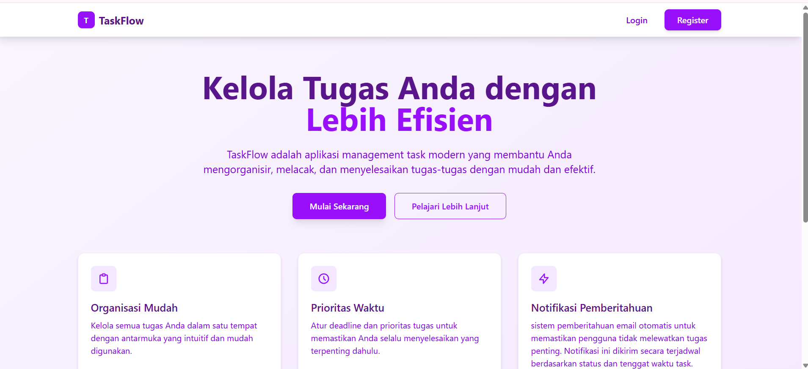
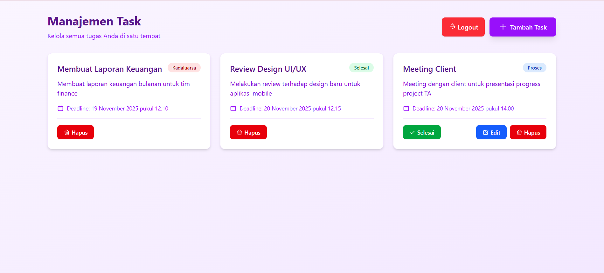

# TaskFlow – Task Management App

TaskFlow adalah aplikasi manajemen tugas dengan fitur **register, login, verifikasi email, notifikasi email (reminder / expired / done), serta CRUD task**.  
Aplikasi ini dibangun menggunakan:

- **Frontend:** React + TailwindCSS  
- **Backend:** Node.js + Express  
- **Database:** PostgreSQL  
- **Email Service:** Nodemailer (Gmail App Password)  
- **Scheduler:** node-cron

---

## 🚀 Fitur Utama

### 🔐 Autentikasi
- Registrasi pengguna
- Login menggunakan JWT
- Verifikasi email (menggunakan token)
- Protected route (frontend & backend)

### 📝 Task Management
- Create task
- Update task
- Delete task
- Update status task menjadi **done**
- Deadline dengan datetime picker
- Status otomatis: `expired`

### 📬 Email Notification
- Reminder H-1 sebelum deadline
- Notifikasi saat task expired
- Notifikasi ketika task selesai (done)
- Cron job berjalan otomatis setiap jam

### 🎨 User Interface
- Dibangun dengan React & Tailwind
- Edit modal untuk update task
- Alert success & error (dengan close button)
- Routing modern menggunakan React Router

---

## ⚙️ Cara Install Project

Ikuti langkah berikut untuk menjalankan aplikasi TaskFlow secara lengkap.

### 🔽 1. Clone Repository

```bash
git clone https://github.com/USERNAME/TaskFlow.git
cd TaskFlow
```

### 🔽 2. Setup Backend
```bash
cd back-end
npm install
backend/.env
```
#### Isi file .env:
```bash
PORT=5000
DB_HOST=localhost
DB_USER=postgres
DB_PASS=your_password_database
DB_NAME=management-task
JWT_SECRET=my_jwt_secret_key
EMAIL_USER=your_gmail
EMAIL_PASS=your_app_password
```
### Buat database dengan nama 'management-task', Berisi:
```bash
CREATE TABLE users (
  id SERIAL PRIMARY KEY,
  name VARCHAR(100) NOT NULL,
  email VARCHAR(150) UNIQUE NOT NULL,
  password TEXT NOT NULL,
  is_verified BOOLEAN DEFAULT FALSE,
  created_at TIMESTAMP DEFAULT CURRENT_TIMESTAMP
);
CREATE TABLE email_verifications (
  id SERIAL PRIMARY KEY,
  user_id INTEGER REFERENCES users(id) ON DELETE CASCADE,
  token VARCHAR(10) NOT NULL,
  expires_at TIMESTAMP NOT NULL,
  created_at TIMESTAMP DEFAULT CURRENT_TIMESTAMP
);
CREATE TABLE tasks (
  id SERIAL PRIMARY KEY,
  user_id INTEGER REFERENCES users(id) ON DELETE CASCADE,
  title VARCHAR(200) NOT NULL,
  description TEXT,
  status VARCHAR(20) DEFAULT 'in-progress', -- in-progress, done, expired
  deadline TIMESTAMP NOT NULL,
  reminded BOOLEAN DEFAULT FALSE,        -- reminder H-1 sudah dikirim atau belum
  expired_notified BOOLEAN DEFAULT FALSE, -- email expired sudah terkirim atau belum
  created_at TIMESTAMP DEFAULT CURRENT_TIMESTAMP,
  updated_at TIMESTAMP DEFAULT CURRENT_TIMESTAMP
);
```

### 🔽 3. Setup Frontend:
```bash
cd front-end
npm install
npm run dev
```

---

## 📌 EndPoint API: http://localhost:5000
🔐 AUTH:
| Method | Endpoint        | Deskripsi                     |
| ------ | --------------- | ----------------------------- |
| POST   | `/api/register` | Registrasi user baru          |
| POST   | `/api/login`    | Login → JWT                   |
| POST   | `/api/verify`   | Verifikasi email + auto login |

📝 TASK CRUD:
| Method | Endpoint                | Deskripsi                                |
| ------ | ----------------------- | ---------------------------------------- |
| GET    | `/api/tasks`            | Semua task milik user login              |
| POST   | `/api/tasks`            | Tambah task                              |
| GET    | `/api/tasks/:id`        | Detail task                              |
| PUT    | `/api/tasks/:id`        | Update task                              |
| DELETE | `/api/tasks/:id`        | Hapus task                               |
| PATCH  | `/api/tasks/:id/status` | Update status → done (+email notifikasi) |

⏱ CRON JOB (Backend Only):
| Fungsi   | Deskripsi                          |
| -------- | ---------------------------------- |
| Reminder | Kirim email pengingat H-1          |
| Expired  | Ubah status expired + email        |
| Done     | Email saat user menyelesaikan task |

---
## 📸Screenshot:


